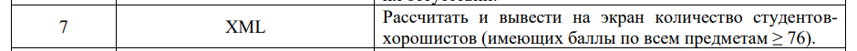
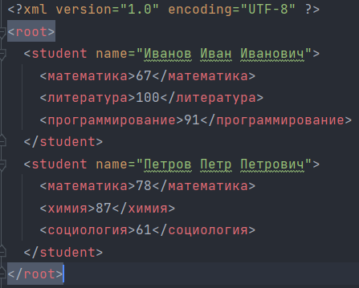
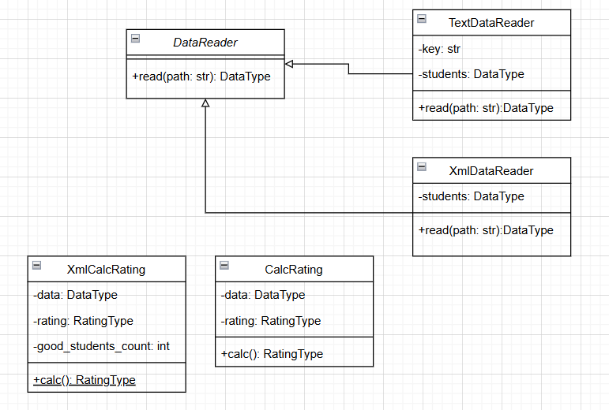

# Лабораторная 1 по дисциплине "Технологии программирования"

Вариант 7

Индивидуальное задание
1. Выберите для Вашего проекта тип лицензии и добавьте файл с лицензией в проект.
2. Добавьте в проект файл .gitignore и сформируйте его содержимое.
3. Добавьте в проект еще один класс – наследник класса DataReader, который должен
обрабатывать входной файл определенного формата (согласно индивидуальному варианту, см. 
таблицу). Составьте модульные тесты для методов этого класса, постарайтесь покрыть тестами 
максимально возможный объем кода. Для работы с этим заданием создайте новую ветку кода на основе 
главной и фиксируйте в нее весь программный код в процессе разработки. Добейтесь выполнения всех 
тестов проекта, после чего объедините текущую ветку кода с главной.
4. Добавьте в проект класс, реализующий расчет определенных характеристик студентов 
(согласно индивидуальному варианту, см. таблицу). Составьте модульные тесты для методов этого 
класса, постарайтесь покрыть тестами максимально возможный объем кода. Для работы с этим 
заданием создайте новую ветку кода на основе главной и фиксируйте в нее весь программный код в 
процессе разработки. Добейтесь выполнения всех тестов проекта, после чего объедините текущую 
ветку кода с главной.
5. Составьте UML-диаграмму классов итогового проекта.
6. Проанализируйте полученные результаты и сделайте выводы.

# Диаграмма классов

# Для запуска были выполнены следующие команды
C:\...\TP_lab_1
conda create -n tplab1-env python=3.10

conda activate tplab1-env

pip install –r requirements.txt

pycodestyle.exe src test

$env:PYTHONPATH = "./;./src"

pytest.exe test

python.exe src\main.py -p data\data.xml

